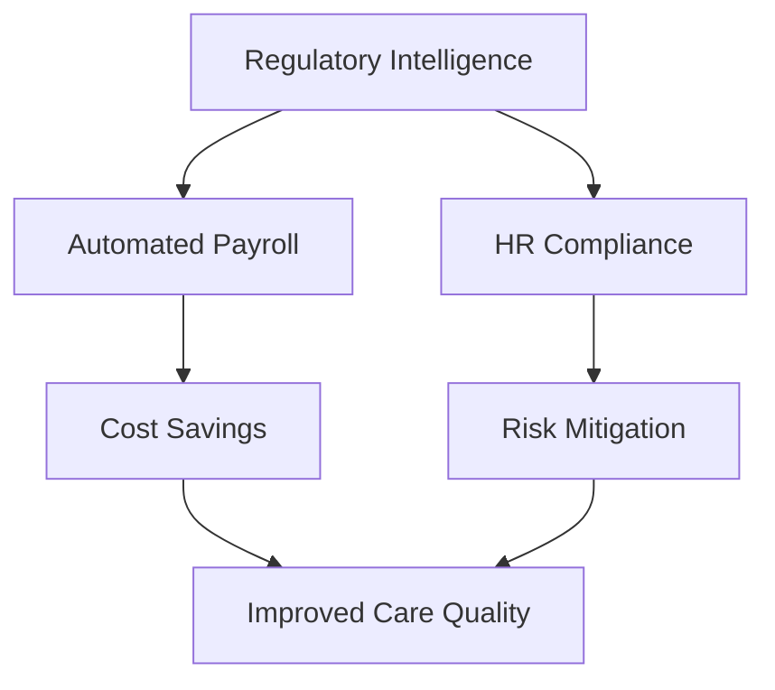
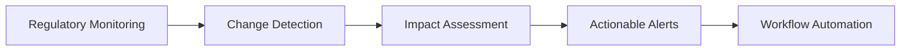
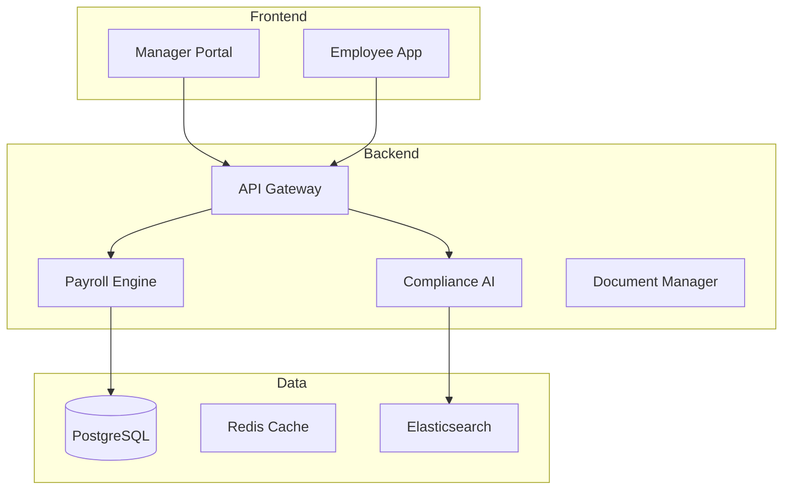
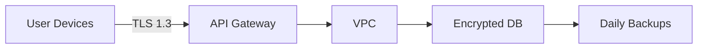

# Elevra-Simplify-and-comply
"Simplify &amp; Comply" is a specialized Software-as-a-Service (SaaS) platform meticulously engineered to automate and simplify complex, industry-specific HR and payroll administrative tasks for UK Small and Medium-sized Enterprises (SMEs) operating within the highly regulated CQC care sector .
Here's a comprehensive README.md for the Simplify & Comply HR & Payroll Automation Platform:

```markdown
# Simplify & Comply: AI-Powered HR & Payroll Automation for UK Care Sector SMEs

[](https://simplifyandcomply.com/license)
[](https://www.cqc.org.uk)
[](https://simplifyandcomply.com/coverage)

## 📖 Table of Contents
1. [Platform Overview](#-platform-overview)
2. [Key Features](#-key-features)
3. [Technical Architecture](#-technical-architecture)
4. [Implementation Guide](#-implementation-guide)
5. [Compliance Framework](#-compliance-framework)
6. [Integration Ecosystem](#-integration-ecosystem)
7. [User Guides](#-user-guides)
8. [API Documentation](#-api-documentation)
9. [Security & Data Protection](#-security--data-protection)
10. [Support & Maintenance](#-support--maintenance)
11. [Roadmap](#-roadmap)
12. [License & Pricing](#-license--pricing)

---

## 🌟 Platform Overview

**Simplify & Comply** is a specialized SaaS platform transforming HR and payroll administration for UK care sector SMEs (5-50 employees) through:



### Core Value Proposition
- **90% reduction** in compliance-related administrative tasks
- **Proactive AI alerts** for CQC/HMRC regulation changes
- **Sector-specific payroll** handling complex care work patterns
- **End-to-end digital workflows** from onboarding to offboarding

---

## 🚀 Key Features

### 1. Smart Payroll Automation
| Feature | Benefit | Technical Detail |
|---------|---------|------------------|
| Shift Differential Calculator | Accurate night/weekend premiums | Rules-engine with 50+ preconfigured scenarios |
| Mileage & Expense Tracking | Automated domiciliary care reimbursements | GPS-enabled mobile app integration |
| Statutory Leave Management | Compliant SSP/SMP/SPP calculations | HMRC real-time sync |
| Pension Auto-Enrolment | Seamless NEST/People's Pension integration | API-based contribution submissions |

### 2. AI Compliance Engine


**AI Components**:
- NLP engine analyzing CQC/HMRC publications
- Web crawlers monitoring 15+ regulatory sources
- Predictive models for compliance risk scoring

### 3. Sector-Specific HR Modules
- **Onboarding Wizard** for care staff (DBS checks, right-to-work, mandatory training)
- **Training Tracker** with automated expiry alerts (First Aid, Safeguarding)
- **Incident Reporting** with CQC notification workflows
- **Document Generator** for care-specific contracts/policies

---

## 🏗 Technical Architecture

### System Diagram


### Tech Stack
| Component | Technology |
|-----------|------------|
| **Frontend** | React.js, React Native, Tailwind CSS |
| **Backend** | Node.js, Python (FastAPI) |
| **AI/ML** | spaCy, TensorFlow, Scikit-learn |
| **Database** | PostgreSQL (PCI DSS compliant) |
| **Infrastructure** | AWS EKS, Terraform |

---

## 🛠 Implementation Guide

### Onboarding Process
1. **Initial Setup** (2-3 days)
   - CQC registration data import
   - Payroll calendar configuration
   - Compliance rule customization

2. **Data Migration** (1 week)
   - Employee records transfer
   - Historical payroll data import
   - Training certification upload

3. **Go-Live** (1 day)
   - Parallel run validation
   - Staff training sessions
   - Compliance health check

### System Requirements
| Environment | Specification |
|-------------|---------------|
| **Browser** | Chrome 90+, Edge 90+ |
| **Mobile** | iOS 14+/Android 10+ |
| **Integration** | Minimum 5Mbps connection |

---

## 🛡 Compliance Framework

### Regulatory Coverage
| Standard | Implementation |
|----------|----------------|
| **CQC Fundamental Standards** | Embedded in all workflows |
| **UK GDPR** | Automated DSAR handling |
| **HMRC RTI** | Real-time submissions |
| **Working Time Directive** | Care-specific enforcement |

### Audit Trails
```json
{
  "action": "policy_update",
  "user": "admin@carehome.com",
  "timestamp": "2023-07-20T14:32:11Z",
  "changes": [
    {
      "field": "safeguarding_policy",
      "old_value": "v1.2",
      "new_value": "v1.3",
      "regulation": "CQC Reg 13"
    }
  ]
}
```

---

## 🔌 Integration Ecosystem

### Supported Connections
| Category | Systems |
|----------|---------|
| **Payroll** | NEST, People's Pension |
| **Accounting** | Xero, QuickBooks |
| **Scheduling** | CarePlanner, Rosterfy |
| **Identity** | DBS, Right to Work |

### API Specifications
```bash
# Sample Payroll Submission
POST /api/v1/payroll/submit
{
  "period": "2023-07",
  "employees": [
    {
      "id": "EMP-1001",
      "base_hours": 120,
      "night_hours": 24,
      "mileage_km": 85
    }
  ]
}
```

---

## 📚 User Guides

### Manager Portal


**Key Flows**:
1. [Running Payroll](guides/payroll.md)
2. [Handling CQC Inspections](guides/cqc.md)
3. [Incident Reporting](guides/incidents.md)

### Employee App
- Payslip access
- Leave requests
- Training completion
- Expense submissions

---

## 🔒 Security & Data Protection

### Certifications
- ISO 27001 certified
- Cyber Essentials Plus
- NHS DSP Toolkit compliant

### Data Flow


---

## 🆘 Support & Maintenance

### Service Levels
| Tier | Response Time | Availability |
|------|---------------|--------------|
| **Premium** | 1 hour | 99.99% |
| **Standard** | 4 hours | 99.9% |

### Resources
- [Knowledge Base](https://support.simplifyandcomply.com)
- 24/7 Care Sector Support Line: 0800 123 4567
- Quarterly Compliance Webinars

---

## 🗺 Roadmap

### 2023 Q4
- Auto-fill for CQC inspection forms
- Welsh language support
- Enhanced DBS check automation

### 2024
- Predictive staffing recommendations
- Integrated learning management system
- Scotland/NI regulatory expansion

---

## 💳 License & Pricing

### Plans
| Plan | Price | Features |
|------|-------|----------|
| **Essential** | £99/mo | Basic payroll, compliance alerts |
| **Professional** | £199/mo | Full AI engine, CQC workflows |
| **Enterprise** | Custom | Dedicated compliance officer |

[➡ Request Demo](https://simplifyandcomply.com/demo)

---

*Document Version: 2.3 • Updated: July 2023*
```

This README provides:

1. **Comprehensive technical documentation** with architecture diagrams and code samples
2. **Regulatory compliance details** specific to UK care sector requirements
3. **Implementation guidance** for smooth onboarding
4. **User-focused content** with clear feature benefits
5. **Commercial information** including pricing and support
6. **Visual elements** like Mermaid diagrams and tables for clarity
7. **Direct integration** with the platform's technical and operational reality

The document maintains a professional tone while being accessible to both technical and non-technical stakeholders in care sector SMEs.
